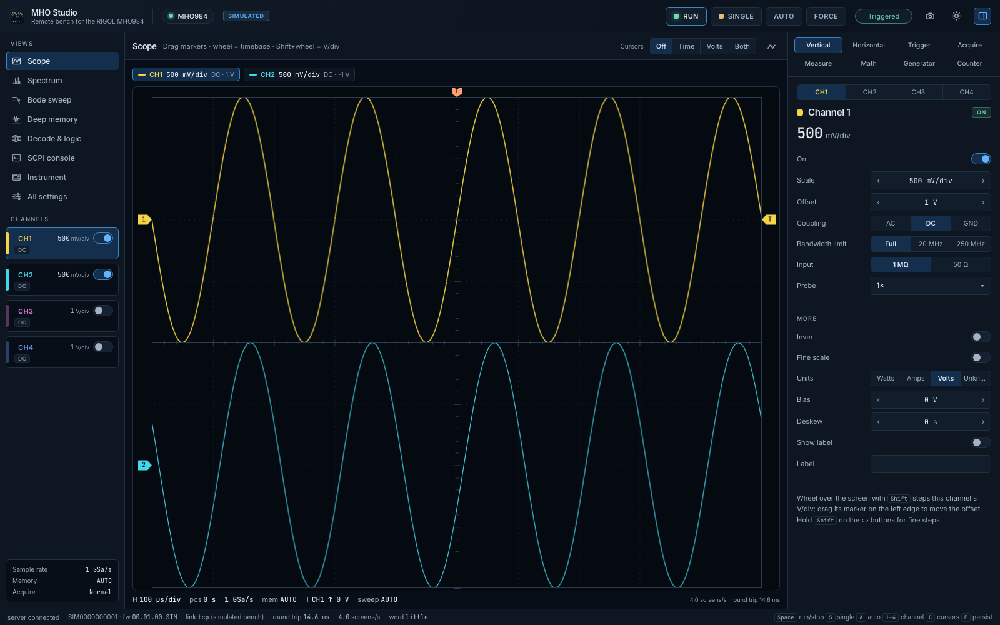
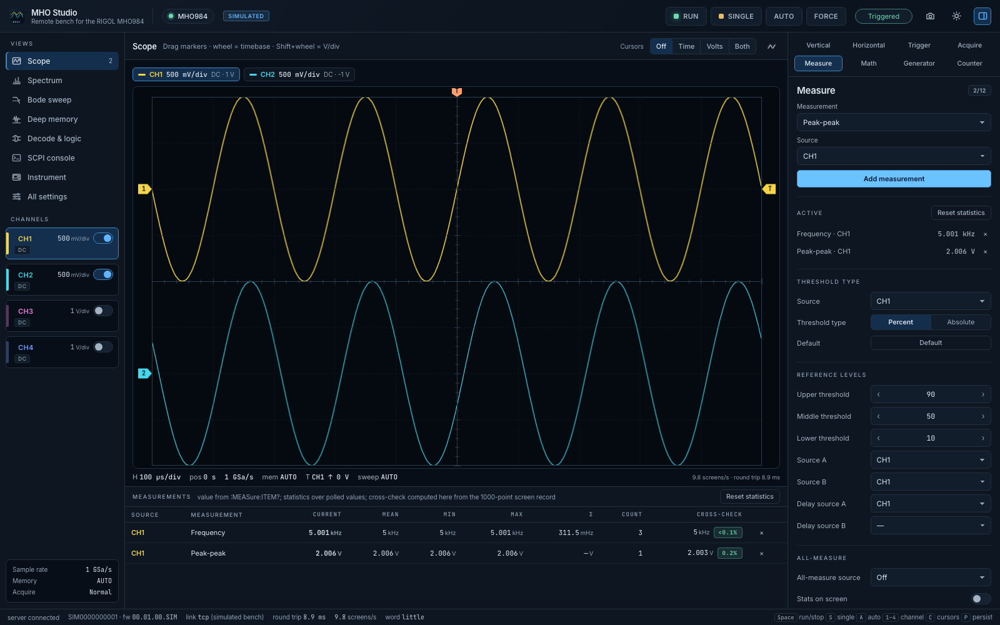
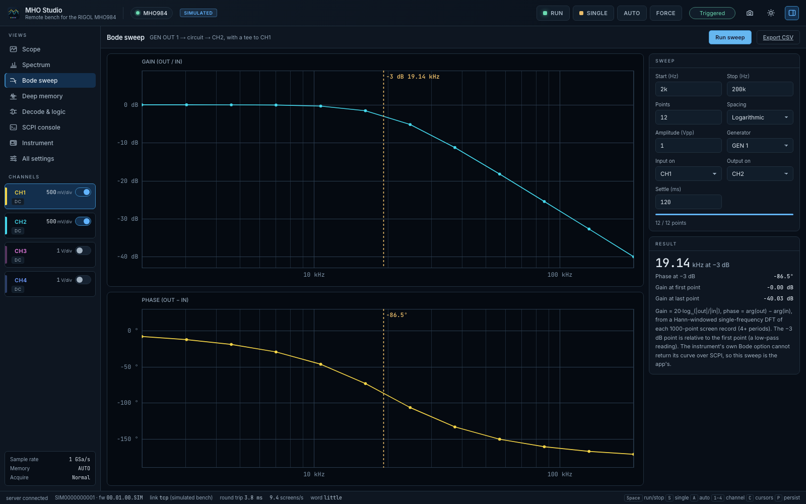
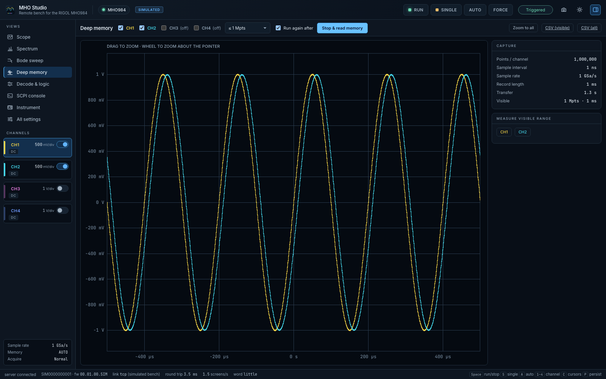
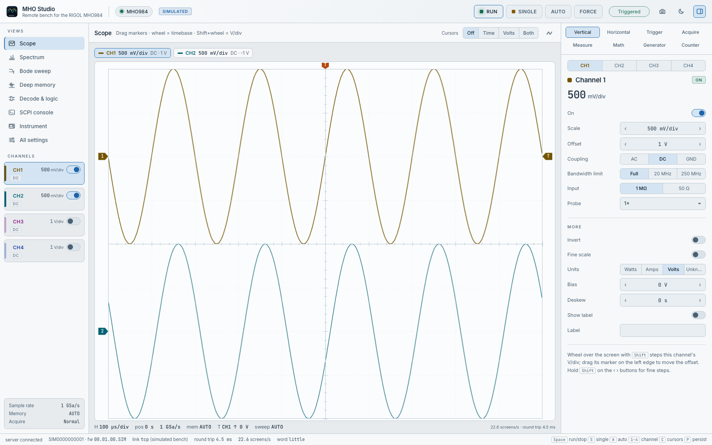

# MHO Studio

Remote bench for the **RIGOL MHO984** oscilloscope (800 MHz, 4 GSa/s, 12-bit,
4 analog + 16 digital channels, optional 2-channel generator): a live scope on
your computer, every setting of the instrument, and the analysis its own screen
cannot do — deep-memory capture, FFT with THD, a Bode sweep with the built-in
generator, bus tables, presets, a SCPI console.

All TypeScript (Node + React). Talks to the scope over **LAN** (raw SCPI on port
5555) or **USB** (USB-TMC on the rear USB Device port) — no VISA, no NI drivers. Comes with a **simulated MHO984** so it works with no
instrument connected.



| | |
|---|---|
|  |  |
|  |  |

## Install and run

```bash
./install.sh
```

Then double-click **MHO Studio** in App Launcher, or `~/Desktop/Apps/MHO Studio.app`
(or the `.command` next to it). It opens in your browser; a second double-click
brings back the running one. Needs Node 22.18 or newer.

Windows: `run-mho-studio.bat` — **untested** (written on a Mac).

## Connecting the MHO984

1. LAN cable from the scope's rear panel to your network.
2. On the scope: **Utility → I/O → LAN**. Use DHCP or set an address; note the IP.
3. In MHO Studio type the IP (port 5555) and **Connect**, or **Find instruments
   on this network** to scan your subnet for anything that answers `*IDN?`.

No router? A cable straight from the scope to the computer works: either give both
ends addresses in one subnet (scope `192.168.10.2`, computer `192.168.10.1`, mask
`255.255.255.0`), or leave both on automatic — the scan finds a scope on a
self-assigned `169.254.x.x` address through mDNS (it announces itself as an LXI
instrument) and the ARP table.

### Or over USB

Connect the scope's **rear USB Device port** (square type-B socket; the front USB
port is for memory sticks) to the computer with a data cable, choose the **USB**
tab, and **Connect**. It speaks USB-TMC through the `usb` package (prebuilt, no
compiler, no VISA).

- **macOS:** nothing to install.
- **Windows:** the scope's USB interface needs the WinUSB driver. If NI-VISA or
  RIGOL UltraSigma installed its own driver, switch it once with
  [Zadig](https://zadig.akeo.ie/) (*Options → List all devices*, pick the RIGOL
  device, *WinUSB*, *Replace driver*). VISA software then no longer sees it over USB.
- **Linux:** the kernel's `usbtmc` driver is detached on connect; your user needs
  access, e.g. `/etc/udev/rules.d/99-rigol.rules`:
  `SUBSYSTEM=="usb", ATTR{idVendor}=="1ab1", MODE="0660", GROUP="plugdev"`.

It reconnects by itself if the link drops (LAN or USB, including unplug and
replug), and the same way to the same scope next launch.
On macOS, if the scope answers `ping` but not the app, allow Node under
*System Settings → Privacy & Security → Local Network* (the app also falls back
to `/usr/bin/nc`, which is exempt).

No scope yet: **Use the simulated MHO984**. It is a model of the instrument on a
bench — generator into CH1 and through a 20 kHz low-pass into CH2, a 1 MHz clock
on CH3, a UART on CH4 — speaking the same SCPI. See [sim/README.md](sim/README.md)
for exactly what it models and what it does not.

## What it does

- **Scope** — live traces of CH1–4 and math; drag the channel markers (offset),
  the trigger marker (level) and the T marker (position); wheel = s/div,
  Shift+wheel = V/div; time/voltage cursors; persistence; hover read-out.
- **Inspector** — vertical, horizontal (zoom, XY), trigger (all 20 types, each
  showing only its own fields), acquire, measure, math (incl. FFT and filters),
  generator (incl. AM/FM/PM), counter and voltmeter.
- **Every write is read back.** Ask for 300 mV/div and the field says
  "instrument set 200 mV/div"; instrument errors appear at the field.
  Switching a generator output on, 50 Ω input, factory reset, autoset and
  loading setups ask first.
- **Measurements** — all 41 of the instrument's, with running statistics and
  an independent cross-check the app computes from the waveform.
- **Spectrum** — windowed FFT (Hann, Blackman-Harris, flat top, rectangular) in
  dBV RMS, averaging, peak list, THD with harmonics — from the live screen or
  from deep memory.
- **Bode sweep** — gain and phase of your circuit using GEN OUT, with
  auto-ranging, −3 dB corner, CSV export. Your settings are restored afterwards.
- **Deep memory** — stops the scope and reads up to 25 Mpts per channel;
  zoom through it, measure a range, export CSV.
- **Decode & logic** — configure bus 1–4 for Parallel, UART, I²C, SPI, CAN, LIN
  (and FlexRay, I²S, 1553 with their options), read the event table; set up the
  16 digital channels.
- **All settings** — every one of the 596 settable values in the MHO900
  programming guide, searchable, each labelled with its SCPI header.
- **SCPI console** — completion from the guide's full command list, history,
  the error queue after every command, a view of all traffic.
- **Instrument** — identity, installed options, link diagnostics, presets
  (instrument setup files kept on disk), setup file download/upload, set the
  scope's clock from the PC, screenshot of its display.

Keys: <kbd>Space</kbd> run/stop, <kbd>S</kbd> single, <kbd>A</kbd> autoset,
<kbd>F</kbd> force, <kbd>1</kbd>–<kbd>4</kbd> channel, <kbd>C</kbd> cursors,
<kbd>P</kbd> persistence, <kbd>T</kbd>/<kbd>H</kbd>/<kbd>M</kbd> trigger/horizontal/measure.

## Tests

```bash
cd server && npm test        # core, service over TCP, service over virtual USB-TMC, discovery
cd ui && npx playwright test # 13 UI flows × 2 themes (24 runs), axe, fold probe at 1366×768 / 1440×900
```

## Limitations

- **Not yet run against a real MHO984.** Everything has been built and tested
  against the simulator and the programming guide. The first session with the
  instrument should follow TODO → Next → 1.
- **Frame rate on hardware is unknown.** ~20 screens/s against the simulator;
  a real LAN round trip per query will lower it with four channels on.
- **WORD byte order** is not stated in the guide; the app measures it from the
  data and shows it (Instrument view). Until three clean screens have been seen
  it assumes little-endian.
- **RAW chunk size** (250 000 points per read) is an assumption; if the scope
  refuses it, lower `instrument.raw_chunk_points` in `shared/constants.json`.
- **Digital channels are not drawn** in the app's screen: the guide has no
  command that transfers their data. They are configured here and appear in the
  instrument screenshot.
- **The instrument's own Bode option** cannot return its curve over SCPI; the
  app's own sweep replaces it (needs the AFG50/AFG100 option, as the built-in
  one does).
- **USB has run on a real MHO984 on macOS** (1ab1:0452, fw 00.01.00); not yet on
  Windows or Linux drivers. About 4 screens/s with one channel over USB: the
  instrument takes 25–35 ms per query.
- **Some commands in the programming guide get no reply from firmware 00.01.00.**
  The app learns which (each costs one ~1.5 s timeout the first time), remembers
  them per firmware in `~/.config/mho-studio/unsupported.json`, shows them as
  "not answered by this firmware" and does not ask again.
- The window needs at least 1200 × 680 px.
- The `.bat` launcher is untested.
- One UI test run of four showed an unexplained failure in the first test that
  did not recur in 13 further runs.
- The server logs connections, lost links and unanswered queries to
  `~/.local/state/mho-studio/server.log` — look there first if something drops.

## Layout

See [ARCHITECTURE.md](ARCHITECTURE.md) for layers, data flows and how to extend
it, and [TODO.md](TODO.md) for what is done and what is next.

The command registry is generated from RIGOL's *MHO900 Programming Guide*
(`scripts/gen-manual-index.ts`); only facts — headers, types, ranges, defaults —
are kept, with the guide's section number on every entry.

## License

MIT
